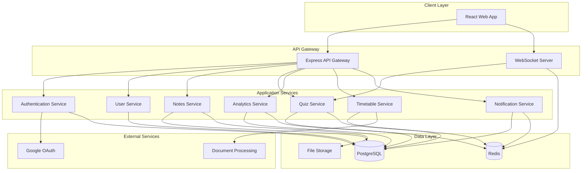
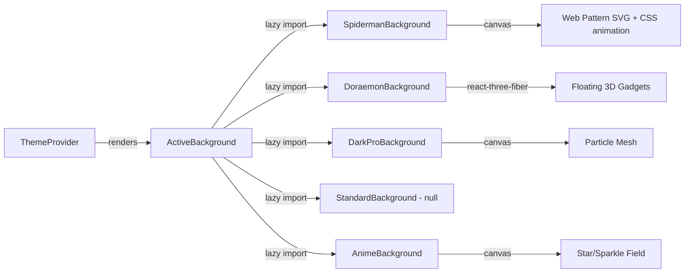
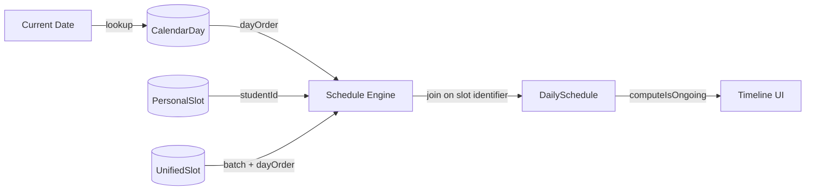

# Design Document: InsightU Platform

## Overview

InsightU is a full-stack academic platform built with a modern web architecture. The system uses a React-based frontend with TypeScript for type safety, a Node.js/Express backend API, PostgreSQL for relational data storage, Redis for caching and real-time features, and WebSocket connections for live quiz functionality. The platform implements role-based access control (RBAC) to serve four distinct user types with appropriate feature access.

The architecture follows a layered approach:
- **Presentation Layer**: React SPA with responsive UI components
- **API Layer**: RESTful API with WebSocket endpoints for real-time features
- **Business Logic Layer**: Service classes handling domain logic
- **Data Access Layer**: Repository pattern with PostgreSQL
- **External Services**: OAuth providers, file storage, notification service

## Architecture

### System Architecture



### Technology Stack

**Frontend:**
- React 18 with TypeScript
- React Router for navigation
- TanStack Query for server state management
- Zustand for client state management
- Chart.js for data visualization
- Socket.io-client for WebSocket connections
- Tailwind CSS for styling
- Framer Motion for animations

**Backend:**
- Node.js with Express
- TypeScript for type safety
- Socket.io for WebSocket server
- Passport.js for authentication
- Multer for file uploads
- Bull for job queues
- Winston for logging

**Database & Caching:**
- PostgreSQL 15 for primary data store
- Redis for session management, caching, and real-time quiz state
- Prisma ORM for database access

**External Services:**
- Google OAuth 2.0 for authentication
- AWS S3 or similar for file storage
- Tesseract.js or cloud OCR for document processing
- SendGrid or similar for email notifications (future)

### Deployment Architecture

- Frontend: Static hosting (Vercel, Netlify, or CloudFront)
- Backend: Container-based deployment (Docker on AWS ECS, GCP Cloud Run, or similar)
- Database: Managed PostgreSQL (AWS RDS, GCP Cloud SQL)
- Cache: Managed Redis (AWS ElastiCache, Redis Cloud)
- File Storage: Object storage (AWS S3, GCP Cloud Storage)

## Components and Interfaces

### Authentication Service

**Responsibilities:**
- Handle OAuth 2.0 flow with Google
- Manage email/password authentication
- Generate and validate JWT tokens
- Manage user sessions

**Key Interfaces:**

```typescript
interface AuthService {
  // OAuth authentication
  initiateGoogleOAuth(): Promise<OAuthRedirectURL>
  handleGoogleCallback(code: string): Promise<AuthResult>
  
  // Email/password authentication
  registerWithEmail(credentials: EmailCredentials): Promise<AuthResult>
  loginWithEmail(credentials: EmailCredentials): Promise<AuthResult>
  
  // Token management
  generateTokens(userId: string, role: UserRole): TokenPair
  refreshAccessToken(refreshToken: string): Promise<string>
  validateToken(token: string): Promise<TokenPayload>
  
  // Session management
  createSession(userId: string): Promise<Session>
  invalidateSession(sessionId: string): Promise<void>
}

interface EmailCredentials {
  email: string
  password: string
}

interface AuthResult {
  user: User
  accessToken: string
  refreshToken: string
}

interface TokenPair {
  accessToken: string
  refreshToken: string
}

interface TokenPayload {
  userId: string
  role: UserRole
  email: string
  exp: number
}
```

### User Service

**Responsibilities:**
- Manage user registration and profiles
- Handle role-based access control
- Manage parent-student linking
- Validate registration numbers

**Key Interfaces:**

```typescript
interface UserService {
  // Student management
  registerStudent(data: StudentRegistrationData): Promise<Student>
  getStudentProfile(studentId: string): Promise<StudentProfile>
  updateStudentProfile(studentId: string, updates: Partial<StudentProfile>): Promise<Student>
  getStudentsByGroup(section: string, batch: number): Promise<Student[]>
  
  // Teacher management
  registerTeacher(data: TeacherRegistrationData): Promise<Teacher>
  getTeacherProfile(teacherId: string): Promise<TeacherProfile>
  
  // Parent management
  registerParent(data: ParentRegistrationData): Promise<Parent>
  linkStudentToParent(parentId: string, studentId: string): Promise<void>
  unlinkStudentFromParent(parentId: string, studentId: string): Promise<void>
  getLinkedStudents(parentId: string): Promise<Student[]>
  
  // Role-based access
  checkPermission(userId: string, resource: string, action: string): Promise<boolean>
  getUserRole(userId: string): Promise<UserRole>
}

interface StudentRegistrationData {
  name: string
  registrationNumber: string
  email: string
  department: string
  year: 1 | 2 | 3 | 4
  section: string
  batch: 1 | 2
  collegeMailId: string
}

interface StudentProfile extends StudentRegistrationData {
  id: string
  group: string // Computed: section + batch
  createdAt: Date
}

enum UserRole {
  STUDENT = 'STUDENT',
  TEACHER = 'TEACHER',
  PARENT = 'PARENT',
  ADMIN = 'ADMIN'
}
```

### Lecture Notes Service

**Responsibilities:**
- Handle file uploads for lecture materials
- Organize notes by subject, topic, and date
- Manage student bookmarks and annotations
- Provide document viewing capabilities

**Key Interfaces:**

```typescript
interface NotesService {
  // Upload and management
  uploadNote(teacherId: string, file: File, metadata: NoteMetadata): Promise<LectureNote>
  deleteNote(noteId: string, teacherId: string): Promise<void>
  updateNoteMetadata(noteId: string, metadata: Partial<NoteMetadata>): Promise<LectureNote>
  
  // Retrieval
  getNotesBySubject(subject: string, filters: NoteFilters): Promise<LectureNote[]>
  getNotesByTopic(topic: string, filters: NoteFilters): Promise<LectureNote[]>
  getNote(noteId: string): Promise<LectureNote>
  
  // Student interactions
  bookmarkNote(studentId: string, noteId: string): Promise<void>
  unbookmarkNote(studentId: string, noteId: string): Promise<void>
  getBookmarkedNotes(studentId: string): Promise<LectureNote[]>
  
  // Annotations
  addAnnotation(studentId: string, noteId: string, annotation: Annotation): Promise<Annotation>
  getAnnotations(studentId: string, noteId: string): Promise<Annotation[]>
  deleteAnnotation(annotationId: string): Promise<void>
}

interface NoteMetadata {
  subject: string
  topic: string
  title: string
  description?: string
  lectureDate: Date
}

interface LectureNote {
  id: string
  teacherId: string
  fileUrl: string
  fileType: 'pdf' | 'image' | 'slides'
  metadata: NoteMetadata
  uploadedAt: Date
}

interface Annotation {
  id: string
  studentId: string
  noteId: string
  content: string
  page?: number
  position?: { x: number; y: number }
  createdAt: Date
}
```

### Quiz Service

**Responsibilities:**
- Create and manage quiz sessions
- Handle real-time quiz participation
- Generate QR codes and session codes
- Calculate results and topic-level analytics
- Manage leaderboards

**Key Interfaces:**

```typescript
interface QuizService {
  // Quiz creation
  createQuiz(teacherId: string, quiz: QuizDefinition): Promise<Quiz>
  updateQuiz(quizId: string, updates: Partial<QuizDefinition>): Promise<Quiz>
  deleteQuiz(quizId: string): Promise<void>
  
  // Session management
  startQuizSession(quizId: string, teacherId: string): Promise<QuizSession>
  endQuizSession(sessionId: string): Promise<QuizResults>
  getActiveSession(sessionCode: string): Promise<QuizSession | null>
  
  // Student participation
  joinSession(studentId: string, sessionCode: string): Promise<void>
  submitAnswer(sessionId: string, studentId: string, answer: Answer): Promise<void>
  
  // Real-time updates
  broadcastQuestion(sessionId: string, questionIndex: number): Promise<void>
  updateLeaderboard(sessionId: string): Promise<Leaderboard>
  
  // Results and analytics
  getQuizResults(sessionId: string): Promise<QuizResults>
  getStudentQuizHistory(studentId: string): Promise<QuizParticipation[]>
  getTopicPerformanceFromQuiz(sessionId: string): Promise<TopicPerformance[]>
}

interface QuizDefinition {
  title: string
  subject: string
  questions: QuizQuestion[]
  timePerQuestion: number // seconds
}

interface QuizQuestion {
  id: string
  text: string
  options: string[]
  correctAnswer: number // index of correct option
  topic: string
  points: number
}

interface QuizSession {
  id: string
  quizId: string
  sessionCode: string
  qrCodeUrl: string
  status: 'waiting' | 'active' | 'completed'
  currentQuestionIndex: number
  participants: string[] // student IDs
  startedAt: Date
}

interface Answer {
  questionId: string
  selectedOption: number
  timestamp: Date
}

interface Leaderboard {
  entries: LeaderboardEntry[]
  updatedAt: Date
}

interface LeaderboardEntry {
  studentId: string
  studentName: string
  score: number
  rank: number
}

interface QuizResults {
  sessionId: string
  totalParticipants: number
  questionResults: QuestionResult[]
  topicPerformance: TopicPerformance[]
  leaderboard: Leaderboard
}

interface QuestionResult {
  questionId: string
  correctAnswers: number
  incorrectAnswers: number
  averageTime: number
}
```

### Analytics Service

**Responsibilities:**
- Calculate Academic Health Score
- Identify weak subjects and topics
- Generate performance trends
- Aggregate data from multiple sources
- Provide study recommendations

**Key Interfaces:**

```typescript
interface AnalyticsService {
  // Academic Health Score
  calculateAcademicHealthScore(studentId: string): Promise<number>
  getHealthScoreBreakdown(studentId: string): Promise<HealthScoreBreakdown>
  
  // Subject analysis
  getSubjectPerformance(studentId: string): Promise<SubjectPerformance[]>
  identifyWeakSubjects(studentId: string, threshold: number): Promise<string[]>
  
  // Topic analysis
  getTopicPerformance(studentId: string, subject?: string): Promise<TopicPerformance[]>
  identifyWeakTopics(studentId: string, threshold: number): Promise<TopicPerformance[]>
  
  // Trends
  getPerformanceTrends(studentId: string, timeRange: TimeRange): Promise<PerformanceTrend[]>
  
  // Recommendations
  getStudyRecommendations(studentId: string): Promise<StudyRecommendation[]>
  
  // Class analytics (for teachers)
  getClassPerformance(teacherId: string, subject: string): Promise<ClassPerformance>
  identifyClassWideWeakTopics(teacherId: string, subject: string): Promise<TopicPerformance[]>
}

interface HealthScoreBreakdown {
  overallScore: number
  quizScore: number
  assignmentScore: number
  examScore: number
  consistencyScore: number
}

interface SubjectPerformance {
  subject: string
  averageScore: number
  trend: 'improving' | 'declining' | 'stable'
  assessmentCount: number
  lastAssessmentDate: Date
}

interface TopicPerformance {
  topic: string
  subject: string
  averageScore: number
  assessmentCount: number
  status: 'strong' | 'weak' | 'neutral'
  recommendedNotes: string[] // note IDs
}

interface PerformanceTrend {
  date: Date
  subject: string
  score: number
  assessmentType: 'quiz' | 'assignment' | 'exam'
}

interface StudyRecommendation {
  topic: string
  subject: string
  reason: string
  recommendedNotes: LectureNote[]
  priority: 'high' | 'medium' | 'low'
}

interface ClassPerformance {
  subject: string
  averageScore: number
  studentCount: number
  topicBreakdown: TopicPerformance[]
}
```

### Marks Processing Service

**Responsibilities:**
- Parse CSV/Excel files with exam marks
- Match registration numbers to students
- Map questions to topics
- Update performance data

**Key Interfaces:**

```typescript
interface MarksProcessingService {
  // File processing
  uploadMarksFile(teacherId: string, file: File, metadata: MarksMetadata): Promise<ProcessingJob>
  getProcessingStatus(jobId: string): Promise<JobStatus>
  
  // Question-topic mapping
  mapQuestionsToTopics(examId: string, mappings: QuestionTopicMapping[]): Promise<void>
  getQuestionMappings(examId: string): Promise<QuestionTopicMapping[]>
  
  // Data extraction
  parseMarksFile(file: File): Promise<ParsedMarksData>
  matchStudents(registrationNumbers: string[]): Promise<StudentMatchResult[]>
  
  // Data storage
  saveExamMarks(examId: string, marks: StudentMarks[]): Promise<void>
  updateTopicPerformance(studentId: string, topicScores: TopicScore[]): Promise<void>
}

interface MarksMetadata {
  examName: string
  subject: string
  examDate: Date
  totalMarks: number
}

interface ParsedMarksData {
  headers: string[]
  rows: MarksRow[]
  questionColumns: number[] // indices of question columns
}

interface MarksRow {
  registrationNumber: string
  questionMarks: number[]
  totalMarks: number
}

interface QuestionTopicMapping {
  questionNumber: number
  topic: string
  maxMarks: number
}

interface StudentMatchResult {
  registrationNumber: string
  studentId: string | null
  matched: boolean
}

interface StudentMarks {
  studentId: string
  questionMarks: number[]
  totalMarks: number
  topicScores: TopicScore[]
}

interface TopicScore {
  topic: string
  scored: number
  maxMarks: number
  percentage: number
}

interface ProcessingJob {
  id: string
  status: 'pending' | 'processing' | 'completed' | 'failed'
  progress: number
  result?: ProcessingResult
  error?: string
}

interface ProcessingResult {
  totalRows: number
  matchedStudents: number
  unmatchedStudents: number
  unmatchedRegistrationNumbers: string[]
}
```

### Timetable Service

**Responsibilities:**
- Process uploaded timetable PDFs/images
- Extract structured timetable data
- Generate daily schedules based on batch and day order
- Manage academic calendar

**Key Interfaces:**

```typescript
interface TimetableService {
  // Admin uploads
  uploadTimetable(year: number, batch: number, file: File): Promise<TimetableUpload>
  uploadAcademicCalendar(file: File): Promise<CalendarUpload>
  
  // Document processing
  extractTimetableData(fileUrl: string): Promise<TimetableData>
  extractCalendarData(fileUrl: string): Promise<CalendarData>
  
  // Schedule generation
  getDailySchedule(studentId: string, date: Date): Promise<DailySchedule | null>
  getCurrentDayOrder(date: Date): Promise<number | null>
  
  // Data management
  saveTimetableData(year: number, batch: number, data: TimetableData): Promise<void>
  saveCalendarData(data: CalendarData): Promise<void>
  getTimetableAvailability(year: number): Promise<boolean>
}

interface TimetableUpload {
  id: string
  year: number
  batch: number
  fileUrl: string
  status: 'processing' | 'completed' | 'failed'
  uploadedAt: Date
}

interface CalendarUpload {
  id: string
  fileUrl: string
  status: 'processing' | 'completed' | 'failed'
  uploadedAt: Date
}

interface TimetableData {
  year: number
  batch: number
  schedule: DaySchedule[]
}

interface DaySchedule {
  dayOrder: number
  periods: Period[]
}

interface Period {
  periodNumber: number
  startTime: string
  endTime: string
  subject: string
  teacher?: string
  room?: string
}

interface CalendarData {
  academicYear: string
  dayOrderMapping: DayOrderEntry[]
}

interface DayOrderEntry {
  date: Date
  dayOrder: number
  isHoliday: boolean
  holidayName?: string
}

interface DailySchedule {
  date: Date
  dayOrder: number
  periods: Period[]
  isHoliday: boolean
}
```

### Notification Service

**Responsibilities:**
- Send in-app notifications
- Manage notification preferences
- Track notification delivery and read status

**Key Interfaces:**

```typescript
interface NotificationService {
  // Sending notifications
  sendNotification(notification: NotificationData): Promise<void>
  sendBulkNotifications(notifications: NotificationData[]): Promise<void>
  
  // Retrieval
  getUserNotifications(userId: string, filters: NotificationFilters): Promise<Notification[]>
  getUnreadCount(userId: string): Promise<number>
  
  // Management
  markAsRead(notificationId: string): Promise<void>
  markAllAsRead(userId: string): Promise<void>
  deleteNotification(notificationId: string): Promise<void>
  
  // Preferences
  updateNotificationPreferences(userId: string, preferences: NotificationPreferences): Promise<void>
}

interface NotificationData {
  userId: string
  type: NotificationType
  title: string
  message: string
  actionUrl?: string
  metadata?: Record<string, any>
}

enum NotificationType {
  NEW_LECTURE_NOTE = 'NEW_LECTURE_NOTE',
  QUIZ_STARTED = 'QUIZ_STARTED',
  QUIZ_SCHEDULED = 'QUIZ_SCHEDULED',
  ASSIGNMENT_POSTED = 'ASSIGNMENT_POSTED',
  PERFORMANCE_ALERT = 'PERFORMANCE_ALERT',
  SYSTEM_ANNOUNCEMENT = 'SYSTEM_ANNOUNCEMENT'
}

interface Notification extends NotificationData {
  id: string
  read: boolean
  createdAt: Date
}

interface NotificationFilters {
  type?: NotificationType
  read?: boolean
  startDate?: Date
  endDate?: Date
}

interface NotificationPreferences {
  enableInApp: boolean
  notificationTypes: NotificationType[]
}
```

## Data Models

### User Models

```typescript
// Base User
interface User {
  id: string
  email: string
  passwordHash?: string // null for OAuth users
  role: UserRole
  createdAt: Date
  updatedAt: Date
}

// Student
interface Student extends User {
  name: string
  registrationNumber: string
  department: string
  year: 1 | 2 | 3 | 4
  section: string
  batch: 1 | 2
  group: string // computed: section + batch
  collegeMailId: string
  linkedParents: string[] // parent IDs
}

// Teacher
interface Teacher extends User {
  name: string
  department: string
  subjects: string[]
}

// Parent
interface Parent extends User {
  name: string
  linkedStudents: string[] // student IDs
}

// Admin
interface Admin extends User {
  name: string
}
```

### Academic Data Models

```typescript
// Lecture Note
interface LectureNote {
  id: string
  teacherId: string
  subject: string
  topic: string
  title: string
  description?: string
  fileUrl: string
  fileType: 'pdf' | 'image' | 'slides'
  lectureDate: Date
  uploadedAt: Date
}

// Student Note Interaction
interface NoteBookmark {
  id: string
  studentId: string
  noteId: string
  createdAt: Date
}

interface NoteAnnotation {
  id: string
  studentId: string
  noteId: string
  content: string
  page?: number
  position?: { x: number; y: number }
  createdAt: Date
  updatedAt: Date
}

// Quiz
interface Quiz {
  id: string
  teacherId: string
  title: string
  subject: string
  questions: QuizQuestion[]
  timePerQuestion: number
  createdAt: Date
}

interface QuizQuestion {
  id: string
  text: string
  options: string[]
  correctAnswer: number
  topic: string
  points: number
}

// Quiz Session
interface QuizSession {
  id: string
  quizId: string
  sessionCode: string
  qrCodeUrl: string
  status: 'waiting' | 'active' | 'completed'
  currentQuestionIndex: number
  startedAt: Date
  endedAt?: Date
}

// Quiz Participation
interface QuizParticipation {
  id: string
  sessionId: string
  studentId: string
  answers: QuizAnswer[]
  score: number
  rank: number
  completedAt: Date
}

interface QuizAnswer {
  questionId: string
  selectedOption: number
  isCorrect: boolean
  timestamp: Date
  timeSpent: number // seconds
}

// Assignment
interface Assignment {
  id: string
  teacherId: string
  subject: string
  topic: string
  title: string
  description: string
  fileUrl?: string
  dueDate: Date
  maxMarks: number
  createdAt: Date
}

// Exam
interface Exam {
  id: string
  teacherId: string
  subject: string
  examName: string
  examDate: Date
  totalMarks: number
  questions: ExamQuestion[]
  createdAt: Date
}

interface ExamQuestion {
  questionNumber: number
  topic: string
  maxMarks: number
}

// Student Performance
interface StudentExamMarks {
  id: string
  examId: string
  studentId: string
  questionMarks: number[]
  totalMarks: number
  percentage: number
  topicScores: TopicScore[]
  recordedAt: Date
}

interface TopicScore {
  topic: string
  scored: number
  maxMarks: number
  percentage: number
}

// Performance Aggregation
interface StudentPerformance {
  id: string
  studentId: string
  subject: string
  topic: string
  assessmentType: 'quiz' | 'assignment' | 'exam'
  score: number
  maxScore: number
  percentage: number
  assessmentDate: Date
}

// Academic Health
interface AcademicHealth {
  id: string
  studentId: string
  overallScore: number
  quizScore: number
  assignmentScore: number
  examScore: number
  consistencyScore: number
  weakSubjects: string[]
  weakTopics: WeakTopic[]
  calculatedAt: Date
}

interface WeakTopic {
  topic: string
  subject: string
  averageScore: number
  recommendedNotes: string[] // note IDs
}
```

### Timetable Models

```typescript
// Timetable
interface Timetable {
  id: string
  year: number
  batch: number
  fileUrl: string
  schedule: DaySchedule[]
  uploadedAt: Date
  processedAt: Date
}

interface DaySchedule {
  dayOrder: number
  periods: Period[]
}

interface Period {
  periodNumber: number
  startTime: string // HH:mm format
  endTime: string
  subject: string
  teacher?: string
  room?: string
}

// Academic Calendar
interface AcademicCalendar {
  id: string
  academicYear: string
  fileUrl: string
  dayOrderMapping: DayOrderEntry[]
  uploadedAt: Date
  processedAt: Date
}

interface DayOrderEntry {
  date: Date
  dayOrder: number
  isHoliday: boolean
  holidayName?: string
}
```

### Notification Models

```typescript
interface Notification {
  id: string
  userId: string
  type: NotificationType
  title: string
  message: string
  actionUrl?: string
  metadata?: Record<string, any>
  read: boolean
  createdAt: Date
}

interface NotificationPreferences {
  id: string
  userId: string
  enableInApp: boolean
  notificationTypes: NotificationType[]
  updatedAt: Date
}
```

### Session Models

```typescript
interface Session {
  id: string
  userId: string
  token: string
  expiresAt: Date
  createdAt: Date
}

interface RefreshToken {
  id: string
  userId: string
  token: string
  expiresAt: Date
  createdAt: Date
}
```

## Correctness Properties

*A property is a characteristic or behavior that should hold true across all valid executions of a system—essentially, a formal statement about what the system should do. Properties serve as the bridge between human-readable specifications and machine-verifiable correctness guarantees.*


### Authentication and Authorization Properties

Property 1: OAuth authentication produces valid tokens
*For any* valid Google OAuth response, the authentication service should return valid access and refresh tokens with correct user information.
**Validates: Requirements 1.1**

Property 2: Credential validation is consistent
*For any* email and password combination, valid credentials should authenticate successfully and invalid credentials should fail with an error.
**Validates: Requirements 1.2**

Property 3: Parent registration enforces email/password
*For any* parent registration attempt, the system should require email and password fields and reject OAuth-only registration.
**Validates: Requirements 1.3**

Property 4: Institutional email acceptance
*For any* valid email format, student and teacher registration should accept the email without domain restrictions.
**Validates: Requirements 1.4**

Property 5: Authentication failure handling
*For any* failed authentication attempt, the system should return a descriptive error and deny access.
**Validates: Requirements 1.5**

Property 6: Role-based access control
*For any* authenticated user and resource request, the system should grant access only if the user's role has permission for that resource, otherwise deny with authorization error.
**Validates: Requirements 3.1, 3.2, 3.3, 3.4, 3.5**

Property 7: Session expiration enforcement
*For any* expired session token, the system should require re-authentication before granting access.
**Validates: Requirements 19.5**

### Student Registration Properties

Property 8: Required field validation
*For any* student registration attempt, the system should reject registrations missing any required field (name, registration number, email, department, year, section, batch, college mail ID).
**Validates: Requirements 2.1**

Property 9: Registration number format validation
*For any* registration number input, the system should accept values matching "RA" followed by one or more digits and reject all other formats.
**Validates: Requirements 2.2**

Property 10: Year value constraints
*For any* year selection, the system should only accept values 1, 2, 3, or 4.
**Validates: Requirements 2.3**

Property 11: Section format validation
*For any* section input, the system should accept single letter values.
**Validates: Requirements 2.4**

Property 12: Batch value constraints
*For any* batch selection, the system should only accept values 1 or 2.
**Validates: Requirements 2.5**

Property 13: Group computation
*For any* section and batch combination, the system should compute the group as section concatenated with batch (e.g., "A" + 1 = "A1").
**Validates: Requirements 2.6**

Property 14: Registration round-trip consistency
*For any* completed student registration, querying the created account should return all the originally provided details.
**Validates: Requirements 2.7**

### Academic Dashboard Properties

Property 15: Subject-wise marks visualization
*For any* student with performance data, the dashboard should return chart data for all subjects with recorded marks.
**Validates: Requirements 4.1**

Property 16: Performance trends computation
*For any* student with multiple performance records, the system should compute and return trend data over time.
**Validates: Requirements 4.2**

Property 17: Academic health score calculation
*For any* student with sufficient performance data, the system should calculate and return an Academic Health Score.
**Validates: Requirements 4.3**

Property 18: Weak subject identification
*For any* student performance data, the system should identify subjects with average scores below the weakness threshold.
**Validates: Requirements 4.4**

Property 19: Weak topic identification
*For any* student performance data, the system should identify topics with average scores below the weakness threshold.
**Validates: Requirements 4.5**

Property 20: Study recommendations generation
*For any* identified weak area (subject or topic), the system should generate study recommendations with relevant lecture notes.
**Validates: Requirements 4.6**

### Lecture Notes Properties

Property 21: File type acceptance
*For any* lecture note upload, the system should accept PDF, image, and presentation slide formats.
**Validates: Requirements 5.1**

Property 22: Metadata requirement enforcement
*For any* lecture note upload attempt, the system should reject uploads without subject and topic tags.
**Validates: Requirements 5.2**

Property 23: Note metadata round-trip consistency
*For any* uploaded lecture note, retrieving the note should return the same metadata (subject, topic, lecture date) that was provided during upload.
**Validates: Requirements 5.3**

Property 24: Note accessibility to students
*For any* uploaded lecture note, students in the corresponding course should be able to query and access the note.
**Validates: Requirements 5.4**

Property 25: Note organization
*For any* student query for lecture notes, the returned notes should be organized by subject, topic, and lecture date.
**Validates: Requirements 5.5**

Property 26: Note viewer data provision
*For any* student accessing a lecture note, the system should return viewer-compatible data for in-app display.
**Validates: Requirements 6.1**

Property 27: Download functionality
*For any* lecture note, the system should provide a download URL when requested by a student.
**Validates: Requirements 6.2**

Property 28: Bookmark round-trip consistency
*For any* bookmarked note, querying the student's bookmarks should return the note.
**Validates: Requirements 6.3**

Property 29: Annotation isolation
*For any* student annotation on a note, the annotation should be stored separately and the original note content should remain unchanged.
**Validates: Requirements 6.4**

Property 30: Note upload notifications
*For any* new lecture note upload, the system should create in-app notifications for all students in the relevant course.
**Validates: Requirements 6.5**

### Quiz System Properties

Property 31: Quiz question validation
*For any* quiz creation, the system should validate that all questions are multiple-choice format with topic tags.
**Validates: Requirements 7.1**

Property 32: Session code uniqueness
*For any* two quiz sessions, the system should generate different session codes.
**Validates: Requirements 7.2**

Property 33: Live leaderboard availability
*For any* active quiz session with participants, the system should compute and return leaderboard data.
**Validates: Requirements 7.4, 8.4**

Property 34: Topic-level quiz analytics
*For any* completed quiz, the system should analyze results and compute topic-level performance metrics.
**Validates: Requirements 7.5**

Property 35: Quiz results accessibility
*For any* completed quiz session, both the teacher and all participating students should be able to access the results with topic-level insights.
**Validates: Requirements 7.6, 8.5**

Property 36: Session joining
*For any* valid session code and student, the system should add the student to the active quiz session.
**Validates: Requirements 8.1**

Property 37: Question options provision
*For any* quiz question displayed to a student, the system should include all multiple-choice options.
**Validates: Requirements 8.2**

Property 38: Answer recording round-trip
*For any* submitted quiz answer, querying the student's responses should return the answer with timestamp.
**Validates: Requirements 8.3**

Property 39: Leaderboard updates
*For any* student answer submission during an active quiz, the system should update the leaderboard to reflect the new scores.
**Validates: Requirements 18.3**

Property 40: Response persistence on session end
*For any* quiz session that ends, all student responses submitted before the end should be recorded in the final results.
**Validates: Requirements 18.5**

### Marks Processing Properties

Property 41: Marks file format acceptance
*For any* marks file upload, the system should accept both CSV and Excel formats.
**Validates: Requirements 9.1**

Property 42: Marks data extraction
*For any* valid marks file, the system should extract registration numbers, question-wise marks, and total marks.
**Validates: Requirements 9.2**

Property 43: Question-topic mapping round-trip
*For any* question-topic mapping created by a teacher, querying the mappings should return the same associations.
**Validates: Requirements 9.3**

Property 44: Student matching
*For any* registration number extracted from a marks file, the system should match it to the corresponding student account if one exists.
**Validates: Requirements 9.4**

Property 45: Unmatched entry handling
*For any* marks file with some unmatched registration numbers, the system should log the unmatched entries and continue processing the matched entries.
**Validates: Requirements 9.5**

Property 46: Performance data updates from marks
*For any* processed marks file, the system should create or update student performance records at both subject and topic levels.
**Validates: Requirements 9.6**

### Topic Performance Properties

Property 47: Multi-source topic performance aggregation
*For any* student and topic, the topic performance should aggregate data from all sources (quizzes, assignments, exam marks).
**Validates: Requirements 10.1, 20.3**

Property 48: Topic classification
*For any* topic with sufficient performance data, the system should classify it as strong or weak based on the performance threshold.
**Validates: Requirements 10.2**

Property 49: Weak topic recommendations
*For any* topic classified as weak, the system should recommend relevant lecture notes for revision.
**Validates: Requirements 10.3**

Property 50: Class-wide weak topic identification
*For any* teacher viewing class analytics for a subject, the system should identify topics that are weak across multiple students.
**Validates: Requirements 10.4**

Property 51: Topic performance recalculation
*For any* new assessment data (quiz, assignment, or exam), the system should recalculate topic performance metrics to include the new data.
**Validates: Requirements 10.5, 16.5**

### Parent Account Properties

Property 52: Parent-student linking
*For any* parent linking a student account, the system should establish a read-only connection that allows the parent to view the student's data.
**Validates: Requirements 11.1**

Property 53: Multiple student access
*For any* parent with multiple linked students, the system should provide access to all linked student dashboards.
**Validates: Requirements 11.2**

Property 54: Parent-student data consistency
*For any* student's academic performance data, the parent view should display the same data visible to the student.
**Validates: Requirements 11.3**

Property 55: Parent view completeness
*For any* parent viewing a child's performance, the system should display subject-wise marks, academic health score, and weak subject alerts.
**Validates: Requirements 11.4**

Property 56: Parent read-only enforcement
*For any* parent attempting to modify student data, the system should reject the modification and maintain read-only access.
**Validates: Requirements 11.5**

Property 57: Parent access restriction
*For any* parent and student account, the parent should only be able to access data for explicitly linked students.
**Validates: Requirements 19.4**

### Timetable Management Properties

Property 58: Timetable file format acceptance
*For any* timetable upload, the system should accept both PDF and image formats.
**Validates: Requirements 12.1**

Property 59: Batch-year timetable specification
*For any* timetable upload, the system should require specification of both year and batch.
**Validates: Requirements 12.2**

Property 60: Calendar file format acceptance
*For any* academic calendar upload, the system should accept PDF and image formats.
**Validates: Requirements 12.3**

Property 61: Timetable data extraction
*For any* uploaded timetable file, the system should extract structured timetable data (periods, times, subjects).
**Validates: Requirements 12.4**

Property 62: Timetable data round-trip consistency
*For any* extracted timetable data, querying the stored timetable should return the structured schedule data.
**Validates: Requirements 12.5**

Property 63: Year 2 schedule generation
*For any* Year 2 student, the system should generate a daily schedule based on their batch, current date, and academic calendar day order.
**Validates: Requirements 13.1**

Property 64: Non-Year-2 unavailability message
*For any* Year 1, Year 3, or Year 4 student viewing timetable, the system should display "Timetable not available yet. Please ask the admin to upload timetable."
**Validates: Requirements 13.2**

Property 65: Day order responsiveness
*For any* change in academic calendar day order, the system should update the displayed timetable to reflect the new day order.
**Validates: Requirements 13.3**

Property 66: Batch-specific timetable selection
*For any* student viewing timetable, the system should use the timetable data corresponding to their batch (Batch 1 or Batch 2).
**Validates: Requirements 13.4, 13.5**

### Admin and Platform Management Properties

Property 67: User listing with roles
*For any* admin accessing user management, the system should return all users with their assigned roles.
**Validates: Requirements 14.2**

Property 68: Platform analytics provision
*For any* admin viewing platform analytics, the system should compute and return usage statistics and performance metrics.
**Validates: Requirements 14.3**

Property 69: Role modification effect
*For any* admin modifying a user's role, the system should update the user's access permissions to match the new role.
**Validates: Requirements 14.4**

Property 70: File upload confirmation
*For any* admin uploading timetable or calendar files, the system should process the files and return confirmation of successful upload.
**Validates: Requirements 14.5**

### Notification Properties

Property 71: Event-triggered notifications
*For any* event that requires notification (note upload, quiz start, assignment post), the system should create in-app notifications for all relevant users.
**Validates: Requirements 15.1, 15.2, 15.3, 16.3**

Property 72: Performance alert distribution
*For any* student with identified weak subjects, the system should send performance alert notifications to both the student and all linked parents.
**Validates: Requirements 15.4**

Property 73: Notification round-trip consistency
*For any* sent notification, querying the user's notification center should return the notification with timestamp and details.
**Validates: Requirements 15.5**

### Assignment Properties

Property 74: Assignment upload with metadata
*For any* assignment upload, the system should accept document files and store them with subject and topic tags.
**Validates: Requirements 16.1**

Property 75: Assignment accessibility
*For any* uploaded assignment, students in the relevant course should be able to query and access the assignment.
**Validates: Requirements 16.2**

Property 76: Assignment marks processing
*For any* uploaded assignment marks, the system should process the marks and update student performance records.
**Validates: Requirements 16.4**

### Performance Aggregation Properties

Property 77: Academic health score multi-source aggregation
*For any* student, the Academic Health Score calculation should include data from quizzes, assignments, and exam marks.
**Validates: Requirements 20.1**

Property 78: Weak subject multi-assessment analysis
*For any* student, weak subject identification should analyze performance across all assessment types (quizzes, assignments, exams) for each subject.
**Validates: Requirements 20.2**

Property 79: Unified performance timeline
*For any* student viewing performance trends, the system should display data points from all assessment types on a unified timeline.
**Validates: Requirements 20.5**

---

## Dynamic Theme System

### Overview

The theme system provides a site-wide visual identity layer that is applied instantly via CSS custom properties. Each theme is a self-contained TypeScript object that defines colors, typography, and a background animation component. The active theme is stored in both `localStorage` (for instant restore on page load) and the user's database record (for cross-device persistence).

### Architecture

```mermaid
graph TD
    subgraph "Frontend"
        TS[ThemeSwitcher UI]
        TC[ThemeContext / ThemeProvider]
        TR[Theme Registry]
        CSS[CSS Custom Properties on :root]
        BG[Per-Theme Background Component]
    end

    subgraph "Backend"
        UP[User Preferences API]
        DB[(User.themePreference in DB)]
    end

    TS -->|selectTheme(id)| TC
    TC -->|applyTheme(theme)| CSS
    TC -->|mount| BG
    TC -->|persist| LS[(localStorage)]
    TC -->|PATCH /api/user/preferences| UP
    UP --> DB
    DB -->|on login| TC
```

### ThemeContext Interface

```typescript
interface ThemeDefinition {
  id: ThemeId
  displayName: string
  colorPalette: {
    background: string       // CSS hex or hsl
    surface: string
    brand: string
    brandDark: string
    textLight: string
    textMuted: string
    accent: string
  }
  typography: {
    fontFamily: string       // Google Fonts family name
    headingWeight: number
  }
  backgroundComponent: React.ComponentType  // Lazy-loaded
  decorativePatterns: string[]              // CSS class names or SVG IDs
}

type ThemeId =
  | 'spiderman'
  | 'doraemon'
  | 'dark-professional'
  | 'standard-professional'
  | 'anime-cartoon'

interface ThemeContextValue {
  activeTheme: ThemeDefinition
  setTheme: (id: ThemeId) => void
  availableThemes: ThemeDefinition[]
}
```

### Role-Based Default Theme Mapping

| Role    | Default Theme          |
|---------|------------------------|
| STUDENT | `spiderman`            |
| TEACHER | `standard-professional`|
| PARENT  | `doraemon`             |
| ADMIN   | `dark-professional`    |

The default is resolved once on first login. Subsequent logins restore the user's persisted preference.

### CSS Custom Properties Approach

`applyTheme(theme: ThemeDefinition)` writes all palette values to `:root` as CSS variables:

```typescript
function applyTheme(theme: ThemeDefinition): void {
  const root = document.documentElement
  const { colorPalette, typography } = theme
  root.style.setProperty('--color-background', colorPalette.background)
  root.style.setProperty('--color-surface', colorPalette.surface)
  root.style.setProperty('--color-brand', colorPalette.brand)
  root.style.setProperty('--color-brand-dark', colorPalette.brandDark)
  root.style.setProperty('--color-text-light', colorPalette.textLight)
  root.style.setProperty('--color-text-muted', colorPalette.textMuted)
  root.style.setProperty('--color-accent', colorPalette.accent)
  root.style.setProperty('--font-family', typography.fontFamily)
  root.style.setProperty('--font-heading-weight', String(typography.headingWeight))
}
```

All Tailwind utility classes reference these variables via `tailwind.config.js` theme extension, so every component updates instantly without a page reload.

### Theme Persistence Flow

1. User selects theme → `ThemeContext.setTheme(id)` called
2. `applyTheme()` writes CSS variables immediately (synchronous, no flicker)
3. `localStorage.setItem('insightu-theme', id)` for instant restore on next load
4. `PATCH /api/user/preferences { themeId }` persists to DB asynchronously
5. On login, server returns `user.themePreference`; if set, overrides localStorage default

### Theme Definitions

| Theme ID               | Primary Brand  | Background | Key Visual Element          |
|------------------------|---------------|------------|-----------------------------|
| `spiderman`            | `#E23636`     | `#0A0A0F`  | Web-pattern SVG overlay     |
| `doraemon`            | `#1E90FF`     | `#0D1B2A`  | Floating gadget particles   |
| `dark-professional`    | `#66FCF1`     | `#0B0C10`  | Subtle grid / particle mesh |
| `standard-professional`| `#4F46E5`     | `#F8FAFC`  | Clean minimal, no animation |
| `anime-cartoon`        | `#FF6B9D`     | `#1A0A2E`  | Star/sparkle particle field |

---

## 3D Elements and Background Animation Architecture

### Overview

Each theme ships a dedicated background component that renders behind all page content. Components use either `react-three-fiber` / `@react-three/drei` for WebGL-based 3D scenes or a lightweight canvas-based particle system. Framer Motion handles page transitions and micro-animations.

### Background Component Architecture



All background components are `React.lazy`-loaded to avoid bundling unused theme assets.

### Background Component Interface

```typescript
interface BackgroundComponentProps {
  reducedMotion: boolean  // from prefers-reduced-motion media query
}

// Each theme exports a component matching this signature
const SpidermanBackground: React.FC<BackgroundComponentProps>
const DoraemonBackground: React.FC<BackgroundComponentProps>
const DarkProBackground: React.FC<BackgroundComponentProps>
const AnimeBackground: React.FC<BackgroundComponentProps>
// StandardProfessional has no background component (null)
```

### Performance Considerations

- All animation loops use `requestAnimationFrame` and cancel on component unmount
- `prefers-reduced-motion` media query is checked; if true, static fallback is rendered
- Background components are positioned `fixed`, `z-index: -1`, `pointer-events: none`
- Canvas-based components cap particle count at 80 on mobile (viewport width < 768px)
- `react-three-fiber` scenes use `frameloop="demand"` to avoid continuous re-renders when idle

### Framer Motion Page Transitions

All route-level components are wrapped in a `PageTransition` component:

```typescript
const pageVariants = {
  initial: { opacity: 0, y: 12 },
  animate: { opacity: 1, y: 0, transition: { duration: 0.25, ease: 'easeOut' } },
  exit:    { opacity: 0, y: -8, transition: { duration: 0.15 } }
}

const PageTransition: React.FC<{ children: React.ReactNode }> = ({ children }) => (
  <motion.div variants={pageVariants} initial="initial" animate="animate" exit="exit">
    {children}
  </motion.div>
)
```

### Ongoing Class Pulse Animation

The timetable timeline applies a pulsing CSS class to the currently active period card. The `isOngoing` flag is computed server-side by comparing `Date.now()` against each period's `startTime` and `endTime` (stored as minutes-from-midnight integers in `UnifiedSlot`).

```typescript
function computeIsOngoing(startMinutes: number, endMinutes: number): boolean {
  const now = new Date()
  const currentMinutes = now.getHours() * 60 + now.getMinutes()
  return currentMinutes >= startMinutes && currentMinutes < endMinutes
}
```

---

## Portal Scraper Design (Puppeteer + Cheerio)

### Overview

The portal scraper is a two-phase server-side pipeline. Phase 1 uses **Puppeteer** (headless Chromium) to automate login to the SRM Zoho Creator academic portal and fetch the timetable page HTML. Phase 2 passes that HTML to the existing **cheerio** parser to extract structured data. The student's credentials are held only in the Node.js process memory for the duration of the Puppeteer session and are discarded immediately on completion or error — they are never written to any database, log file, or cache.

### Architecture

```mermaid
graph LR
    UI[Student enters SRM login ID + password] -->|HTTPS POST| API[POST /api/student/timetable/sync]
    API -->|in-memory only| PH1[Phase 1: Puppeteer Login & Fetch]
    PH1 -->|navigates| ZC[SRM Zoho Creator Portal]
    ZC -->|returns page HTML| PH1
    PH1 -->|raw HTML string| PH2[Phase 2: Cheerio Parser]
    PH1 -->|credentials discarded| VOID[/dev/null]
    PH2 -->|ScraperOutput| DB[(PersonalSlot records)]
```

### Input / Output Contract

```typescript
interface PortalSyncInput {
  srmLoginId: string    // Student's SRM academia login ID — never persisted
  srmPassword: string   // Student's SRM academia password — never persisted
  studentId: string     // InsightU student ID to associate PersonalSlot records
}

interface ScraperOutput {
  profile: StudentProfile
  slots: PersonalSlot[]
}

interface StudentProfile {
  registrationNumber: string
  name: string
  program: string
  department: string
  semester: string
  batch: string
}

interface PersonalSlot {
  slots: string[]        // e.g. ["P47", "P48"] or ["A"]
  normalizedKey: string  // sorted, comma-joined: "P47,P48"
  subject: string
  room: string
  type: 'theory' | 'lab'
}
```

### Phase 1: Puppeteer Login and HTML Fetch

```typescript
import puppeteer from 'puppeteer'

async function fetchPortalHTML(loginId: string, password: string): Promise<string> {
  const browser = await puppeteer.launch({ headless: true, args: ['--no-sandbox'] })
  try {
    const page = await browser.newPage()
    await page.goto('https://academia.srmist.edu.in', { waitUntil: 'networkidle2' })

    // Fill login form
    await page.type('#loginId', loginId)
    await page.type('#password', password)
    await page.click('#submitBtn')

    // Wait for post-login navigation
    await page.waitForNavigation({ waitUntil: 'networkidle2', timeout: 15000 })

    // Check for login failure (portal stays on login page or shows error)
    const currentUrl = page.url()
    if (currentUrl.includes('login') || currentUrl.includes('error')) {
      throw new PortalAuthError('INVALID_CREDENTIALS', 'SRM portal login failed — check your login ID and password')
    }

    // Navigate to timetable page
    await page.goto('https://academia.srmist.edu.in/#Page:My_Time_Table', { waitUntil: 'networkidle2' })

    // Extract full page HTML
    const html = await page.content()
    return html
  } finally {
    await browser.close()  // Always close — credentials leave memory here
  }
}
```

### Phase 2: Cheerio Parser (unchanged logic)

```typescript
import * as cheerio from 'cheerio'

function parsePortalHTML(html: string): Omit<ScraperOutput, never> {
  const $ = cheerio.load(html)
  const tables = $('table')

  if (tables.length < 1) throw new ScraperError('TABLE_1_NOT_FOUND', 'Profile table not found in portal HTML')
  if (tables.length < 2) throw new ScraperError('TABLE_2_NOT_FOUND', 'Slot table not found in portal HTML')

  const profile = parseProfileTable($, tables.eq(0))
  const slots = parseSlotTable($, tables.eq(1))

  return { profile, slots }
}

function parseProfileTable($: cheerio.CheerioAPI, table: cheerio.Cheerio<cheerio.Element>): StudentProfile {
  const kvPairs: Record<string, string> = {}
  table.find('tr').each((_, row) => {
    const cells = $(row).find('td')
    if (cells.length >= 2) {
      const key = $(cells[0]).text().trim().toLowerCase().replace(/\s+/g, '_')
      const value = $(cells[1]).text().trim()
      kvPairs[key] = value
    }
  })
  return {
    registrationNumber: kvPairs['registration_number'] ?? '',
    name: kvPairs['name'] ?? '',
    program: kvPairs['program'] ?? '',
    department: kvPairs['department'] ?? '',
    semester: kvPairs['semester'] ?? '',
    batch: kvPairs['batch'] ?? '',
  }
}

function parseSlotTable($: cheerio.CheerioAPI, table: cheerio.Cheerio<cheerio.Element>): PersonalSlot[] {
  const slots: PersonalSlot[] = []
  const rows = table.find('tr')

  rows.slice(1).each((_, row) => {
    const cells = $(row).find('td')
    if (cells.length < 5) return

    const slotRaw = $(cells[3]).text().trim()
    const room    = $(cells[4]).text().trim()
    const subject = $(cells[1]).text().trim()

    const slotCodes = slotRaw.split('+').map(s => s.trim()).filter(Boolean)
    const type: 'lab' | 'theory' = slotCodes.length > 1 ? 'lab' : 'theory'
    const normalizedKey = [...slotCodes].sort().join(',')

    slots.push({ slots: slotCodes, normalizedKey, subject, room, type })
  })

  return slots
}
```

### Full Sync Pipeline

```typescript
// Timetable sync — called once, result stored in DB
async function syncTimetable(input: PortalSyncInput): Promise<ScraperOutput> {
  const html = await fetchPortalPage(input.srmLoginId, input.srmPassword, 'timetable')
  // credentials out of scope after fetchPortalPage returns
  return parsePortalHTML(html)
}

// Attendance + marks sync — called on-demand, result stored in DB as Last_Synced_Data
async function syncAttendanceAndMarks(input: PortalSyncInput): Promise<AttendanceMarksOutput> {
  const [attendanceHtml, marksHtml] = await Promise.all([
    fetchPortalPage(input.srmLoginId, input.srmPassword, 'attendance'),
    fetchPortalPage(input.srmLoginId, input.srmPassword, 'marks'),
  ])
  // credentials out of scope after both fetches complete
  return {
    attendance: parseAttendanceHTML(attendanceHtml),
    marks: parseMarksHTML(marksHtml),
    syncedAt: new Date(),
  }
}
```

**Sync type routing:**

| Trigger | Credentials required | Result stored in DB | Credentials discarded |
|---------|---------------------|--------------------|-----------------------|
| First timetable setup | Yes | PersonalSlot records (permanent) | Immediately after fetch |
| On-demand attendance/marks refresh | Yes | Last_Synced_Data (overwritten) | Immediately after fetch |
| Student logs in (subsequent) | No | — | — |
| Student views dashboard | No | Reads Last_Synced_Data | — |

### Slot Type Classification Rule

| Slot String  | Contains `+`? | Type     |
|-------------|---------------|----------|
| `A`         | No            | `theory` |
| `P47`       | No            | `theory` |
| `P47+P48`   | Yes           | `lab`    |
| `L1+L2+L3`  | Yes           | `lab`    |

### Error Handling

```typescript
class PortalAuthError extends Error {
  constructor(
    public code: 'INVALID_CREDENTIALS' | 'PORTAL_UNREACHABLE' | 'SESSION_TIMEOUT',
    message: string
  ) {
    super(message)
    this.name = 'PortalAuthError'
  }
}

class ScraperError extends Error {
  constructor(
    public code: 'TABLE_1_NOT_FOUND' | 'TABLE_2_NOT_FOUND' | 'EMPTY_HTML',
    message: string
  ) {
    super(message)
    this.name = 'ScraperError'
  }
}
```

| Error Code            | HTTP Status | Cause                                              |
|-----------------------|-------------|----------------------------------------------------|
| `INVALID_CREDENTIALS` | 401         | Wrong SRM login ID or password                     |
| `PORTAL_UNREACHABLE`  | 503         | SRM portal is down or network timeout              |
| `SESSION_TIMEOUT`     | 504         | Puppeteer navigation exceeded 15s timeout          |
| `TABLE_1_NOT_FOUND`   | 422         | Portal page structure changed — profile table gone |
| `TABLE_2_NOT_FOUND`   | 422         | Portal page structure changed — slot table gone    |

### Security Constraints

- `srmLoginId` and `srmPassword` exist **only** as local variables inside `fetchPortalHTML()` — they are never assigned to any object that outlives the function call
- The Puppeteer `browser.close()` call is in a `finally` block, guaranteeing cleanup even on error
- The API route handler must not log request bodies for this endpoint (Winston transport must exclude `/api/student/timetable/sync` from body logging)
- The frontend must use `type="password"` for the SRM password field and must not store it in any client-side state (Zustand, localStorage, sessionStorage)
- HTTPS is required for this endpoint in all environments (enforced at the reverse proxy level)

---

## Day Order Timetable Engine

### Overview

The timetable engine joins two data sources to produce a student's daily schedule:

1. **`UnifiedSlot`** — the master schedule mapping `(batch, dayOrder, period)` → `(slots[], startTime, endTime)`
2. **`PersonalSlot`** — the student's scraped slot-to-subject mapping

### Data Flow



### Schedule Computation Algorithm

```typescript
interface ScheduledPeriod {
  period: number
  startTime: number    // minutes from midnight
  endTime: number
  subject: string
  room: string
  type: 'theory' | 'lab' | 'free'
  slotIdentifier: string
  isOngoing: boolean
  isNext: boolean
}

async function getDailySchedule(
  studentId: string,
  date: Date,
  batch: string
): Promise<DailySchedule | HolidayResult> {
  // 1. Look up day order for date
  const calDay = await prisma.calendarDay.findFirst({
    where: { date: startOfDay(date), isActive: true }
  })
  if (!calDay || calDay.dayOrder === null) {
    return { status: 'HOLIDAY', message: calDay?.name ?? 'Holiday' }
  }

  // 2. Fetch student's personal slots
  const personalSlots = await prisma.personalSlot.findMany({
    where: { studentId, isCancelled: false }
  })

  // 3. Fetch unified slots for this batch + day order
  const unifiedSlots = await prisma.unifiedSlot.findMany({
    where: { batch, dayOrder: calDay.dayOrder, isActive: true }
  })

  // 4. Join: for each unified slot, find matching personal slot
  const schedule: ScheduledPeriod[] = unifiedSlots.map(us => {
    const match = personalSlots.find(ps =>
      ps.slots.some(s => us.slots.includes(s))
    )
    return {
      period: us.period,
      startTime: us.startTime,
      endTime: us.endTime,
      subject: match?.subject ?? 'Free Period',
      room: match?.room ?? '',
      type: match?.type ?? 'free',
      slotIdentifier: us.slots.join('+'),
      isOngoing: computeIsOngoing(us.startTime, us.endTime),
      isNext: false,  // computed after sort
    }
  })

  // 5. Sort by start time, mark next upcoming period
  schedule.sort((a, b) => a.startTime - b.startTime)
  const nextIdx = schedule.findIndex(p => !p.isOngoing && p.startTime > currentMinutes())
  if (nextIdx !== -1) schedule[nextIdx].isNext = true

  return { status: 'SCHEDULE', dayOrder: calDay.dayOrder, schedule }
}
```

### Day Order Lookup Invariant

Every date in the `CalendarDay` table maps to **exactly one** active record. The `@@unique([date, version])` constraint combined with `isActive: true` filtering ensures this. The engine always queries with `isActive: true` to get the current version.

### Vacation Predictor Integration

The vacation predictor reuses the calendar lookup to count working days in a date range:

```typescript
function countWorkingDays(startDate: Date, endDate: Date, calendar: CalendarDay[]): number {
  const calMap = new Map(calendar.map(d => [d.date.toISOString().slice(0, 10), d]))
  let count = 0
  let cursor = new Date(startDate)
  while (cursor <= endDate) {
    const key = cursor.toISOString().slice(0, 10)
    const entry = calMap.get(key)
    if (entry && entry.dayOrder !== null) count++
    cursor.setDate(cursor.getDate() + 1)
  }
  return count
}

function computeRiskScore(projectedAttendance: number): number {
  // Risk is 0 when attendance >= 85%, scales to 10 when attendance <= 60%
  if (projectedAttendance >= 85) return 0
  if (projectedAttendance <= 60) return 10
  return Math.round(((85 - projectedAttendance) / 25) * 10)
}
```

**Monotonicity invariant**: `computeRiskScore` is monotonically non-decreasing as `projectedAttendance` decreases (i.e., as vacation length increases, risk score never decreases).

---

## Section Feed Architecture

### Overview

The Section Feed is a GCR-style collaborative post feed scoped to a composite key of `year + section + department`. Only users whose profile matches all three dimensions can read or write to a feed.

### Data Models

```typescript
// Composite scope key
type SectionKey = `${number}-${string}-${string}`  // e.g. "2-A-CSE"

interface SectionPost {
  id: string
  sectionKey: SectionKey      // Denormalized composite key for fast lookup
  year: number
  section: string
  department: string
  authorId: string
  authorName: string
  authorRole: 'STUDENT' | 'TEACHER'
  text: string
  attachments: Attachment[]
  createdAt: Date
  comments: SectionComment[]
}

interface SectionComment {
  id: string
  postId: string
  authorId: string
  authorName: string
  authorRole: 'STUDENT' | 'TEACHER'
  text: string
  createdAt: Date
}

interface Attachment {
  url: string
  filename: string
  mimeType: string
  sizeBytes: number
}
```

### Section Feed Service Interface

```typescript
interface SectionFeedService {
  // Post operations
  createPost(authorId: string, sectionKey: SectionKey, data: CreatePostData): Promise<SectionPost>
  getPosts(requesterId: string, sectionKey: SectionKey, cursor?: string): Promise<PostPage>
  deletePost(authorId: string, postId: string): Promise<void>

  // Comment operations
  addComment(authorId: string, postId: string, text: string): Promise<SectionComment>
  getComments(postId: string): Promise<SectionComment[]>

  // Authorization
  assertMembership(userId: string, sectionKey: SectionKey): Promise<void>
}

interface CreatePostData {
  text: string
  attachments?: File[]
}

interface PostPage {
  posts: SectionPost[]
  nextCursor: string | null
}
```

### Scoping and Authorization

`assertMembership` resolves the user's `year + section + department` from their profile and compares it to the requested `sectionKey`. If they don't match, a 403 is returned. This check runs on every read and write operation.

Teachers are members of a section via the `SectionTeacher` join table. Students are members by their `year + section + department` profile fields.

### Real-Time Updates via WebSocket

Each section feed has a dedicated Socket.io room named by its `sectionKey`:

```typescript
// Server: when a post is created
io.to(`section:${sectionKey}`).emit('new_post', post)

// Client: join room on mount
socket.emit('join_section', sectionKey)
socket.on('new_post', (post) => queryClient.invalidateQueries(['section-feed', sectionKey]))
```

### Database Schema Additions

The existing `SectionPost` model in the Prisma schema needs a `sectionKey` denormalized column and a `comments` relation. The `SectionComment` model needs to be added:

```prisma
model SectionPost {
  id          String           @id @default(uuid())
  sectionKey  String           // "year-section-department" e.g. "2-A-CSE"
  year        Int
  section     String
  department  String
  authorId    String
  authorName  String
  authorRole  String           // "STUDENT" | "TEACHER"
  text        String
  attachments Json?
  createdAt   DateTime         @default(now())
  comments    SectionComment[]

  @@index([sectionKey, createdAt])
}

model SectionComment {
  id         String      @id @default(uuid())
  postId     String
  post       SectionPost @relation(fields: [postId], references: [id], onDelete: Cascade)
  authorId   String
  authorName String
  authorRole String
  text       String
  createdAt  DateTime    @default(now())

  @@index([postId, createdAt])
}
```

---

## New Correctness Properties (Requirements 18–25)

*A property is a characteristic or behavior that should hold true across all valid executions of a system—essentially, a formal statement about what the system should do. Properties serve as the bridge between human-readable specifications and machine-verifiable correctness guarantees.*

### Property 80: Role-based default theme assignment

*For any* new user, the default theme resolved by `getDefaultTheme(role)` should match the role-to-theme mapping: STUDENT → `spiderman`, TEACHER → `standard-professional`, PARENT → `doraemon`, ADMIN → `dark-professional`.

**Validates: Requirements 18.2, 18.3, 18.4, 18.5**

### Property 81: Theme application sets all required CSS variables

*For any* valid theme definition, calling `applyTheme(theme)` should set all required CSS custom properties (`--color-background`, `--color-surface`, `--color-brand`, `--color-brand-dark`, `--color-text-light`, `--color-text-muted`, `--color-accent`, `--font-family`) to non-empty values on `:root`.

**Validates: Requirements 18.6, 18.9**

### Property 82: Theme preference round-trip

*For any* user and any valid `ThemeId`, saving the theme preference then loading it should return the same `ThemeId`.

**Validates: Requirements 18.7**

### Property 83: Theme switching is idempotent

*For any* valid theme, applying it twice in succession should produce an identical CSS variable state as applying it once.

**Validates: Requirements 18.6**

### Property 84: HTML scraper slot type classification

*For any* slot string, the scraper should classify it as `"lab"` if and only if the string contains the `+` character; otherwise it should classify it as `"theory"`.

**Validates: Requirements 20.3**

### Property 85: HTML scraper idempotence

*For any* valid portal HTML string, calling the scraper twice on the same input should produce identical `PersonalSlot` arrays (same slots, subjects, rooms, and types in the same order).

**Validates: Requirements 20.6**

### Property 86: HTML scraper profile field completeness

*For any* valid portal HTML with a well-formed first table, the scraper output's `profile` object should contain non-empty values for all six fields: `registrationNumber`, `name`, `program`, `department`, `semester`, and `batch`.

**Validates: Requirements 20.1**

### Property 87: HTML scraper slot row count preservation

*For any* valid portal HTML with N data rows in the second table, the scraper should produce exactly N `PersonalSlot` records.

**Validates: Requirements 20.2**

### Property 88: HTML scraper error on missing tables

*For any* HTML string that does not contain the expected two-table structure, the scraper should throw a `ScraperError` with a descriptive message identifying which table was missing.

**Validates: Requirements 20.5**

### Property 89: Day Order lookup completeness

*For any* date stored in the `CalendarDay` table with `isActive: true`, `getDayOrder(date)` should return exactly one value (either an integer 1–5 or `null` for a holiday) — never `undefined` or multiple values.

**Validates: Requirements 21.1, 22.4**

### Property 90: Daily schedule ordering invariant

*For any* computed daily schedule, the periods should be in non-decreasing order of `startTime`.

**Validates: Requirements 21.2, 21.3**

### Property 91: Ongoing class detection correctness

*For any* period with `startTime` and `endTime` (in minutes from midnight), `computeIsOngoing(startTime, endTime)` should return `true` if and only if the current time in minutes falls within `[startTime, endTime)`.

**Validates: Requirements 19.6, 21.4**

### Property 92: Vacation risk score monotonicity

*For any* student attendance record, the `Survival_Risk_Score` should be monotonically non-decreasing as the number of missed working days increases — i.e., a longer vacation never produces a lower risk score than a shorter one.

**Validates: Requirements 23.3**

### Property 93: Working day count excludes holidays

*For any* date range, `countWorkingDays(start, end, calendar)` should return a count equal to the number of days in the range where the `CalendarDay` entry has a non-null `dayOrder`.

**Validates: Requirements 23.1**

### Property 94: Calendar validation rejects invalid entries

*For any* calendar JSON where at least one value is not an integer 1–5 or the string `"Holiday"`, the upload validator should reject the input and return a list containing all invalid entries.

**Validates: Requirements 22.2, 22.3**

### Property 95: Section feed scoping

*For any* post created with `sectionKey` X, a feed query by a user whose `sectionKey` is Y (where Y ≠ X) should not include that post in the results.

**Validates: Requirements 25.1, 25.2, 25.3**

### Property 96: Section post data completeness

*For any* created section post, the retrieved post object should contain non-empty values for `authorName`, `authorRole`, `createdAt`, `text`, and `sectionKey`.

**Validates: Requirements 25.5**

### Property 97: Section comment round-trip

*For any* post and comment, after calling `addComment(postId, text)`, querying `getComments(postId)` should return a list that includes a comment with the same `text` and `authorId`.

**Validates: Requirements 25.6**

---

## Error Handling

### Error Categories

**Authentication Errors:**
- Invalid credentials (401 Unauthorized)
- Expired tokens (401 Unauthorized)
- Missing authentication (401 Unauthorized)
- Invalid OAuth state (400 Bad Request)

**Authorization Errors:**
- Insufficient permissions (403 Forbidden)
- Resource not owned by user (403 Forbidden)
- Parent accessing non-linked student (403 Forbidden)

**Validation Errors:**
- Missing required fields (400 Bad Request)
- Invalid format (registration number, email, etc.) (400 Bad Request)
- Invalid file type (400 Bad Request)
- File size exceeded (413 Payload Too Large)

**Resource Errors:**
- Resource not found (404 Not Found)
- Duplicate resource (409 Conflict)
- Resource already exists (409 Conflict)

**Processing Errors:**
- File parsing failed (422 Unprocessable Entity)
- OCR extraction failed (422 Unprocessable Entity)
- Marks file format invalid (422 Unprocessable Entity)

**System Errors:**
- Database connection failed (500 Internal Server Error)
- External service unavailable (503 Service Unavailable)
- Unexpected errors (500 Internal Server Error)

### Error Response Format

All errors follow a consistent JSON structure:

```typescript
interface ErrorResponse {
  error: {
    code: string // Machine-readable error code
    message: string // Human-readable error message
    details?: any // Additional context (validation errors, etc.)
    timestamp: string
    requestId: string
  }
}
```

### Error Handling Strategies

**Graceful Degradation:**
- If OCR fails, allow manual timetable entry
- If analytics calculation fails, show partial data with warning
- If notification delivery fails, log and retry

**Retry Logic:**
- File uploads: 3 retries with exponential backoff
- External API calls: 3 retries with exponential backoff
- Database operations: 2 retries for transient errors

**Logging:**
- All errors logged with Winston
- Include request ID, user ID, timestamp, stack trace
- Sensitive data (passwords, tokens) excluded from logs

**User Feedback:**
- Clear, actionable error messages
- Avoid exposing internal implementation details
- Provide guidance on how to resolve the error

## Testing Strategy

### Dual Testing Approach

The InsightU platform requires both unit testing and property-based testing for comprehensive coverage:

**Unit Tests:**
- Specific examples demonstrating correct behavior
- Edge cases (empty inputs, boundary values, special characters)
- Error conditions and exception handling
- Integration points between services
- Mock external dependencies (OAuth, file storage, OCR)

**Property-Based Tests:**
- Universal properties that hold for all inputs
- Comprehensive input coverage through randomization
- Validate correctness properties from design document
- Each property test runs minimum 100 iterations

### Property-Based Testing Configuration

**Library Selection:**
- Use **fast-check** for TypeScript/JavaScript property-based testing
- Fast-check provides generators for common types and custom generators

**Test Configuration:**
```typescript
import fc from 'fast-check'

// Example configuration
fc.assert(
  fc.property(
    fc.string(), // arbitrary string generator
    (input) => {
      // Property assertion
    }
  ),
  { numRuns: 100 } // Minimum 100 iterations
)
```

**Test Tagging:**
Each property-based test must reference its design document property:

```typescript
describe('Feature: insightu-platform, Property 9: Registration number format validation', () => {
  it('should accept valid RA format and reject invalid formats', () => {
    // Property test implementation
  })
})
```

### Testing Layers

**1. Unit Tests (Jest)**

Test individual functions and methods in isolation:
- Service methods
- Utility functions
- Data transformations
- Validation logic

Example areas:
- `validateRegistrationNumber()` - test valid/invalid formats
- `computeGroup()` - test section + batch combinations
- `calculateAcademicHealthScore()` - test score calculation logic
- `parseMarksFile()` - test CSV/Excel parsing

**2. Property-Based Tests (fast-check)**

Test universal properties across all inputs:
- Authentication properties (Properties 1-7)
- Registration properties (Properties 8-14)
- RBAC properties (Property 6)
- Data aggregation properties (Properties 47, 77-79)
- Round-trip properties (Properties 14, 23, 28, 38, 43, 62, 73)

Example:
```typescript
// Property 9: Registration number format validation
describe('Feature: insightu-platform, Property 9: Registration number format validation', () => {
  it('should accept RA followed by digits and reject other formats', () => {
    fc.assert(
      fc.property(
        fc.string(),
        (regNumber) => {
          const isValid = /^RA\d+$/.test(regNumber)
          const result = validateRegistrationNumber(regNumber)
          
          if (isValid) {
            expect(result.valid).toBe(true)
          } else {
            expect(result.valid).toBe(false)
          }
        }
      ),
      { numRuns: 100 }
    )
  })
})
```

**3. Integration Tests**

Test interactions between services:
- API endpoints with database
- Authentication flow with session management
- File upload with storage service
- Quiz session with WebSocket and Redis

**4. End-to-End Tests (Playwright)**

Test complete user workflows:
- Student registration and login
- Teacher uploading lecture notes
- Student joining and completing quiz
- Parent viewing child's performance
- Admin uploading timetable

### Test Coverage Goals

- Unit test coverage: 80% minimum
- Property-based tests: All 79 correctness properties implemented
- Integration test coverage: All service interactions
- E2E test coverage: All critical user paths

### Testing Tools

- **Jest**: Unit and integration testing framework
- **fast-check**: Property-based testing library
- **Supertest**: HTTP API testing
- **Playwright**: End-to-end browser testing
- **MSW (Mock Service Worker)**: API mocking
- **testcontainers**: Database testing with Docker

### Continuous Integration

- Run all tests on every pull request
- Property-based tests run with 100 iterations in CI
- E2E tests run on staging environment
- Performance tests run nightly
- Test results reported to PR with coverage metrics

### Test Data Management

**Generators for Property Tests:**
- Student data generator (valid registration numbers, emails, etc.)
- Quiz data generator (questions, answers, sessions)
- Performance data generator (marks, scores, dates)
- Timetable data generator (schedules, periods)

**Fixtures for Unit Tests:**
- Sample student profiles
- Sample lecture notes
- Sample quiz definitions
- Sample marks files (CSV/Excel)

**Database Seeding:**
- Seed test database with realistic data
- Use factories for creating test entities
- Clean database between test runs

### Performance Testing

While not part of functional correctness, performance tests validate:
- Quiz system handles 100-200 concurrent users
- API response times under load
- Database query performance
- File upload and processing times

Use tools like:
- **Artillery** or **k6** for load testing
- **Lighthouse** for frontend performance
- Database query profiling

## Deployment Considerations

### Environment Configuration

**Development:**
- Local PostgreSQL and Redis
- Mock OAuth for testing
- Local file storage
- Debug logging enabled

**Staging:**
- Managed database and cache
- Real OAuth integration
- Cloud file storage
- Info-level logging

**Production:**
- High-availability database
- Redis cluster for caching
- CDN for static assets
- Error-level logging
- Monitoring and alerting

### Database Migrations

- Use Prisma migrations for schema changes
- Version control all migrations
- Test migrations on staging before production
- Backup database before migrations

### Monitoring and Observability

**Metrics:**
- API response times
- Error rates by endpoint
- Database query performance
- WebSocket connection count
- File upload success/failure rates

**Logging:**
- Structured JSON logs
- Request ID tracing
- User action audit logs
- Error stack traces

**Alerting:**
- High error rates
- Slow API responses
- Database connection issues
- Failed file processing jobs

### Security Considerations

**Authentication:**
- JWT tokens with short expiration (15 minutes for access, 7 days for refresh)
- Secure token storage (httpOnly cookies)
- CSRF protection for state-changing operations

**Authorization:**
- Validate user permissions on every request
- Prevent horizontal privilege escalation (user accessing other user's data)
- Prevent vertical privilege escalation (student accessing admin features)

**Data Protection:**
- Encrypt sensitive data at rest
- Use HTTPS for all communications
- Sanitize user inputs to prevent injection attacks
- Rate limiting on authentication endpoints

**File Upload Security:**
- Validate file types and sizes
- Scan uploaded files for malware
- Store files with random names to prevent enumeration
- Serve files through CDN with signed URLs

### Scalability Considerations

**Horizontal Scaling:**
- Stateless API servers (can add more instances)
- Session data in Redis (shared across instances)
- Load balancer distributes traffic

**Database Optimization:**
- Index frequently queried columns
- Use connection pooling
- Implement read replicas for analytics queries
- Cache frequently accessed data in Redis

**File Storage:**
- Use object storage (S3) for scalability
- Implement CDN for fast file delivery
- Compress images and PDFs

**Real-time Features:**
- WebSocket server can scale horizontally with Redis pub/sub
- Use sticky sessions for WebSocket connections
- Implement reconnection logic in client

## Future Enhancements

**Phase 2 Features:**
- Mobile applications (iOS and Android)
- Email notifications in addition to in-app
- Push notifications for mobile
- Video lecture support
- Discussion forums per subject
- Peer-to-peer study groups

**Advanced Analytics:**
- Predictive analytics for student performance
- AI-powered study recommendations
- Comparative analytics (student vs class average)
- Learning pattern analysis

**Enhanced Timetable:**
- Support for all years (not just Year 2)
- Automatic conflict detection
- Room booking integration
- Event calendar integration

**Collaboration Features:**
- Real-time collaborative note-taking
- Study session scheduling
- Group quiz competitions
- Teacher-student messaging

