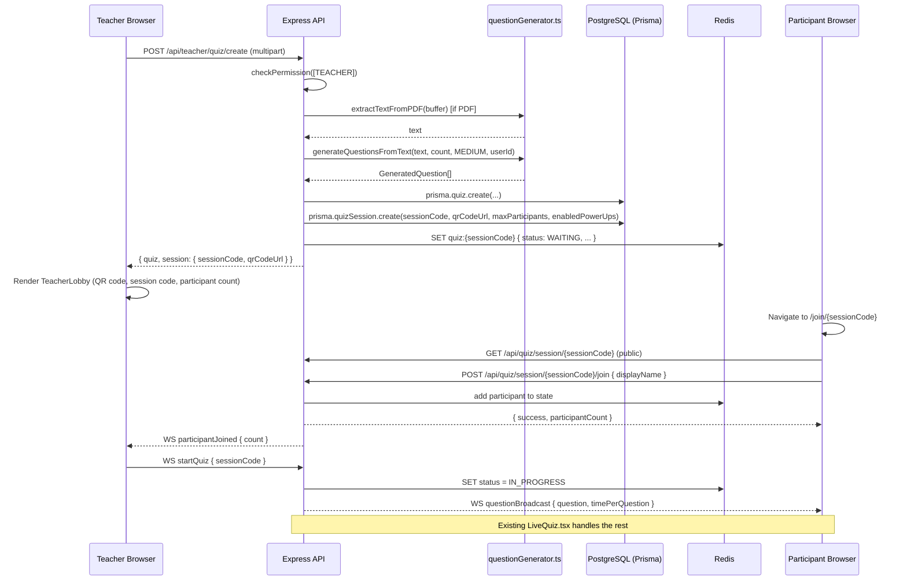

# Design Document: Teacher Quiz Portal

## Overview

The Teacher Quiz Portal adds a Kahoot-style live quiz creation and hosting flow to InsightU, restricted exclusively to teachers. A teacher fills out a single form (topic, optional PDF, question count, time per question, max participants, power-up toggles), the backend AI-generates questions, immediately starts a quiz session, and returns a QR code + session code for the lobby screen. Participants join via `/join/:sessionCode` — a public, unauthenticated page — and are dropped into the existing `LiveQuiz.tsx` experience.

The feature touches four layers:

1. **RBAC** — lock `POST /api/quiz` and the new `POST /api/teacher/quiz/create` to `TEACHER` role only; hide/redirect the creation UI from students and parents.
2. **Backend** — new `POST /api/teacher/quiz/create` endpoint that orchestrates PDF extraction → AI generation → `createQuiz()` → `startQuizSession()` in one atomic flow; schema migration to add `maxParticipants` and `enabledPowerUps` to `QuizSession`.
3. **Frontend** — new `/teacher/quiz/create` page (creation form + lobby screen), new `/join/:sessionCode` public page, wired "Create Quiz" button on `TeacherDashboard`.
4. **Real-time** — the join page calls the existing `joinSession` socket event; the lobby screen listens for `participantJoined`; the teacher's "Start Quiz" button emits `startQuiz`; everything else is handled by the existing `LiveQuiz.tsx` + `realtime.ts`.

---

## Architecture



### Key Design Decisions

**Single endpoint for create + launch**: Rather than a two-step "create quiz then start session" flow, `POST /api/teacher/quiz/create` does both atomically. This matches the UX requirement (teacher gets QR code immediately) and avoids orphaned quiz records.

**Reuse `startQuizSession()`**: The existing function in `core.ts` already generates a unique session code, creates a QR code encoding `https://insightu.dev/join/{sessionCode}`, persists the `QuizSession` row, and seeds Redis state. We extend it to accept `maxParticipants` and `enabledPowerUps`.

**Schema migration for `QuizSession`**: Add `maxParticipants Int @default(30)` and `enabledPowerUps String[] @default([])` to the `QuizSession` model. The `grantPowerUpsToStudent` function in `powerups.ts` is updated to filter by the session's `enabledPowerUps` list.

**Public join page**: `/join/:sessionCode` sits outside `DashboardLayout` (no auth required). It calls a new public endpoint `POST /api/quiz/session/:sessionCode/join` that accepts a `displayName` and adds the participant to Redis state. Authenticated users get their real `userId`; unauthenticated users get a generated guest ID.

**RBAC on `POST /api/quiz`**: The existing route currently has no role check. We add `checkPermission(['TEACHER'])` middleware. The new teacher-specific endpoint at `/api/teacher/quiz/create` is already under `/api/teacher` which should be teacher-gated.

---

## Components and Interfaces

### Backend: New Endpoint

```
POST /api/teacher/quiz/create
Content-Type: multipart/form-data
Authorization: Bearer <teacher-jwt>

Fields:
  topic          string   (required)
  questionCount  number   (1–50, default 10)
  timePerQuestion number  (10–300, default 30)
  maxParticipants number  (1–500, default 30)
  enabledPowerUps string  (JSON array, e.g. '["FIFTY_FIFTY","SHIELD"]')
  pdf            File     (optional, PDF only)
```

Response `201`:
```json
{
  "quiz": { "id": "...", "title": "...", "subject": "...", ... },
  "session": {
    "id": "...",
    "sessionCode": "ABC123",
    "qrCodeUrl": "data:image/png;base64,...",
    "status": "WAITING",
    "maxParticipants": 30,
    "enabledPowerUps": ["FIFTY_FIFTY", "TIME_FREEZE", "DOUBLE_POINTS", "SHIELD"]
  }
}
```

### Backend: Public Join Endpoint

```
POST /api/quiz/session/:sessionCode/join
Content-Type: application/json

Body: { "displayName": "Alice" }
```

Response `200`:
```json
{ "success": true, "participantCount": 3, "guestId": "guest-xxxx" }
```

Error cases:
- `404` — session not found
- `409` — session is IN_PROGRESS or COMPLETED (`"This quiz has already started or ended."`)
- `409` — session is full (`"This quiz session is full."`)

### Backend: `startQuizSession()` Extended Signature

```typescript
export async function startQuizSession(
  quizId: string,
  options?: {
    maxParticipants?: number;       // default 30
    enabledPowerUps?: PowerUpType[]; // default all four
  }
): Promise<QuizSession>
```

The function stores `maxParticipants` and `enabledPowerUps` on the `QuizSession` DB record and also seeds them into the Redis state object so the join endpoint can enforce the cap and `grantPowerUpsToStudent` can filter by enabled types.

### Backend: `grantPowerUpsToStudent()` Updated

```typescript
export async function grantPowerUpsToStudent(
  sessionId: string,
  studentId: string
): Promise<void>
```

Fetches `enabledPowerUps` from the `QuizSession` record and only creates `PowerUp` rows for those types (instead of always creating all four).

### Frontend: `TeacherQuizCreate` Page

Route: `/teacher/quiz/create` (inside `DashboardLayout`, teacher-only)

Two-phase component:
1. **Creation form** — shown initially
2. **Lobby screen** — shown after successful API response

```typescript
interface CreateQuizForm {
  topic: string;
  questionCount: number;       // default 10
  timePerQuestion: number;     // default 30
  maxParticipants: number;     // default 30
  enabledPowerUps: PowerUpType[]; // default all four
  pdfFile: File | null;
}

interface LobbyState {
  sessionCode: string;
  qrCodeUrl: string;
  participantCount: number;
  quizId: string;
  sessionId: string;
}
```

The lobby screen connects to the Socket.io server, joins the session room, and listens for `participantJoined` events to update the live count. The "Start Quiz" button emits `startQuiz { sessionCode }` and navigates the teacher to `/quiz/:sessionCode` (the existing `LiveQuiz.tsx`).

### Frontend: `JoinQuiz` Page

Route: `/join/:sessionCode` (public, outside `DashboardLayout`)

```typescript
interface JoinState {
  displayName: string;
  status: 'idle' | 'loading' | 'error';
  errorMessage: string;
}
```

On submit: calls `POST /api/quiz/session/:sessionCode/join`. On success: navigates to `/quiz/:sessionCode`.

### Frontend: `TeacherDashboard` Changes

- Wire the "Create Quiz" `Button` to `navigate('/teacher/quiz/create')`.
- Add a "My Quizzes" section below the existing panels, fetching from `GET /api/teacher/quizzes`.
- "Launch Again" button calls `POST /api/teacher/quiz/:quizId/relaunch` which starts a new session for an existing quiz.

### Frontend: Route Guard

Add a `TeacherRoute` wrapper component that redirects non-teacher users to `/dashboard`:

```typescript
const TeacherRoute = ({ children }: { children: ReactNode }) => {
  const { user } = useAuthStore();
  if (!user || user.role !== 'TEACHER') return <Navigate to="/dashboard" replace />;
  return <>{children}</>;
};
```

Applied to `/teacher/quiz/create` and `/quiz/builder`.

---

## Data Models

### Schema Migration: `QuizSession`

Add two fields to the existing `QuizSession` model:

```prisma
model QuizSession {
  // ... existing fields ...
  maxParticipants  Int      @default(30)
  enabledPowerUps  String[] @default([])
}
```

Migration file: `add_teacher_quiz_portal_fields`

```sql
ALTER TABLE "QuizSession"
  ADD COLUMN "maxParticipants" INTEGER NOT NULL DEFAULT 30,
  ADD COLUMN "enabledPowerUps" TEXT[] NOT NULL DEFAULT '{}';
```

### Redis State Extension

The existing Redis state object for `quiz:{sessionCode}` gains two new fields:

```typescript
interface QuizRedisState {
  // ... existing fields ...
  maxParticipants: number;
  enabledPowerUps: string[]; // PowerUpType values
}
```

These are seeded by `startQuizSession()` and read by the join endpoint (for cap enforcement) and `grantPowerUpsToStudent` (for filtering).

### New Backend Route: `GET /api/teacher/quizzes`

Returns the teacher's quiz library with session history for the "My Quizzes" dashboard section:

```typescript
interface TeacherQuizSummary {
  id: string;
  title: string;
  subject: string;
  createdAt: string;
  sessionCount: number;
  lastPlayedAt: string | null;
}
```

### New Backend Route: `POST /api/teacher/quiz/:quizId/relaunch`

Starts a new `QuizSession` for an existing quiz using the same `maxParticipants` and `enabledPowerUps` from the most recent session (or defaults if none). Returns the same shape as the create endpoint's `session` field.

---

## Correctness Properties

*A property is a characteristic or behavior that should hold true across all valid executions of a system — essentially, a formal statement about what the system should do. Properties serve as the bridge between human-readable specifications and machine-verifiable correctness guarantees.*

### Property 1: Non-teacher roles are always rejected from quiz creation

*For any* authenticated request to `POST /api/quiz` or `POST /api/teacher/quiz/create` where the user's role is STUDENT or PARENT, the RBAC middleware SHALL return HTTP 403.

**Validates: Requirements 1.1, 1.2**

### Property 2: Topic validation rejects all-whitespace inputs

*For any* string composed entirely of whitespace characters (spaces, tabs, newlines) submitted as the topic field, the creation form SHALL reject the submission and display the validation error "Topic is required", leaving the form state unchanged.

**Validates: Requirements 2.2**

### Property 3: File type validation rejects all non-PDF uploads

*For any* file whose MIME type is not `application/pdf`, the creation form SHALL reject the file and display "Only PDF files are supported", and SHALL NOT submit the form.

**Validates: Requirements 2.3**

### Property 4: Numeric range validation is consistent across all out-of-range values

*For any* integer value outside [1, 50] submitted as `questionCount`, the form SHALL display the validation error and not proceed. *For any* integer value outside [10, 300] submitted as `timePerQuestion`, the form SHALL display the validation error and not proceed. *For any* integer value outside [1, 500] submitted as `maxParticipants`, the form SHALL display the validation error and not proceed.

**Validates: Requirements 3.4, 3.5, 3.6**

### Property 5: Power-up grant respects session configuration

*For any* subset S of the four power-up types enabled in a quiz session, when a participant joins that session, `grantPowerUpsToStudent` SHALL create exactly one `PowerUp` record for each type in S and zero records for types not in S.

**Validates: Requirements 4.3, 4.4**

### Property 6: Enabled power-ups are persisted and retrievable

*For any* set of enabled power-up types provided at quiz creation, the stored `QuizSession.enabledPowerUps` field SHALL contain exactly those types when the session is retrieved from the database.

**Validates: Requirements 4.5**

### Property 7: Quiz creation round-trip preserves all input fields

*For any* valid topic, question count, time per question, and max participants, the `Quiz` record created by `POST /api/teacher/quiz/create` SHALL have `authorId` equal to the requesting teacher's userId, `visibility` equal to `SHAREABLE`, `timePerQuestion` equal to the submitted value, and `questions` containing exactly the number of questions returned by the AI generator.

**Validates: Requirements 5.5**

### Property 8: QR code encodes the correct join URL

*For any* session code generated by `startQuizSession()`, the `qrCodeUrl` data URL SHALL decode to a QR code whose content is exactly `https://insightu.dev/join/{sessionCode}`.

**Validates: Requirements 6.6**

### Property 9: Participant count display reflects WebSocket events

*For any* sequence of `participantJoined` WebSocket events received by the teacher lobby screen, the displayed participant count SHALL equal the `count` value in the most recently received event.

**Validates: Requirements 6.4**

### Property 10: Participant UI shows only enabled power-ups

*For any* quiz session with a specific `enabledPowerUps` configuration, the participant's power-up tray in `LiveQuiz.tsx` SHALL display buttons only for the power-up types present in `enabledPowerUps`, and SHALL NOT display buttons for disabled types.

**Validates: Requirements 4.3, 8.7**

### Property 11: Quiz count stat card reflects actual quiz count

*For any* number N of quizzes created by a teacher, the "Live Quizzes Built" stat card on `TeacherDashboard` SHALL display N.

**Validates: Requirements 9.4**

---

## Error Handling

### Backend Error Responses

| Condition | HTTP Status | Error Message |
|---|---|---|
| Non-teacher role on quiz create | 403 | `"Forbidden: Only teachers can create quizzes"` |
| Missing topic field | 400 | `"Topic is required"` |
| Non-PDF file uploaded | 400 | `"Only PDF files are supported"` |
| PDF text extraction failure | 422 | `"Could not read the uploaded PDF. Please try a different file."` |
| AI returns zero questions | 422 | `"No questions could be generated. Please provide more detailed material or a different topic."` |
| AI config missing (`NO_AI_CONFIG`) | 422 | `"AI provider not configured. Please set up your AI API key in Profile Settings."` |
| Session not found on join | 404 | `"Session not found"` |
| Session already started/ended | 409 | `"This quiz has already started or ended."` |
| Session at capacity | 409 | `"This quiz session is full."` |

### Frontend Error Handling

- All API errors are caught and displayed inline in the form (not as toast notifications) to keep the user in context.
- The lobby screen shows a reconnecting indicator if the WebSocket disconnects, using Socket.io's built-in reconnection.
- If `startQuizSession()` fails after quiz creation (rare), the backend rolls back the quiz record and returns a 500 with a user-friendly message.

### Partial AI Results

When the AI returns fewer questions than requested (but > 0), the backend proceeds and includes a `warning` field in the response:

```json
{
  "quiz": { ... },
  "session": { ... },
  "warning": "Only 7 questions could be generated from the provided material"
}
```

The frontend displays this as a yellow banner on the lobby screen.

---

## Testing Strategy

### Unit Tests

- `validateCreateQuizInput(input)` — test all validation rules with concrete examples (missing topic, wrong file type, out-of-range numbers, all defaults).
- `grantPowerUpsToStudent` with various `enabledPowerUps` subsets — verify correct DB records are created.
- `startQuizSession` with `maxParticipants` and `enabledPowerUps` options — verify they are stored on the session record and seeded into Redis.
- `TeacherQuizCreate` component rendering — verify form fields, defaults, and error display.
- `JoinQuiz` component — verify error states (session full, already started).
- `TeacherRoute` guard — verify redirect for non-teacher users.

### Property-Based Tests

Using **fast-check** (already used in the codebase for existing property tests).

Each property test runs a minimum of **100 iterations**.

Tag format: `Feature: teacher-quiz-portal, Property {N}: {property_text}`

- **Property 1** — Generate random `UserRole` values that are not `TEACHER`, make requests, assert 403.
- **Property 2** — Generate arbitrary whitespace strings as topic, assert form rejects them.
- **Property 3** — Generate arbitrary MIME types excluding `application/pdf`, assert file is rejected.
- **Property 4** — Generate integers outside each valid range, assert correct validation errors. Generate integers inside each range, assert no validation error.
- **Property 5** — Generate random subsets of `['FIFTY_FIFTY', 'TIME_FREEZE', 'DOUBLE_POINTS', 'SHIELD']`, create a session with that subset, call `grantPowerUpsToStudent`, assert exactly those types are created.
- **Property 6** — Generate random power-up subsets, create session, retrieve from DB, assert `enabledPowerUps` matches.
- **Property 7** — Generate random valid topics and question counts (1–50), mock AI to return exactly that many questions, assert the created Quiz record matches.
- **Property 8** — Generate random 6-character alphanumeric session codes, call `startQuizSession`, decode the QR data URL, assert the encoded URL matches `https://insightu.dev/join/{sessionCode}`.
- **Property 9** — Generate random sequences of `participantJoined` events with varying counts, assert the displayed count always equals the last event's count.
- **Property 10** — Generate random `enabledPowerUps` subsets, render the participant UI with that session config, assert only enabled power-up buttons are present.
- **Property 11** — Generate random quiz counts N (0–100), mock the dashboard API to return N, assert the stat card displays N.

### Integration Tests

- Full create flow: POST to `/api/teacher/quiz/create` with a real (small) PDF, verify quiz and session are created in the DB and Redis state is seeded.
- Join flow: POST to `/api/quiz/session/:sessionCode/join`, verify participant is added to Redis state and `participantJoined` is emitted.
- RBAC enforcement: POST to `/api/quiz` with a student JWT, verify 403.
- Relaunch flow: POST to `/api/teacher/quiz/:quizId/relaunch`, verify a new session is created with the same configuration.
